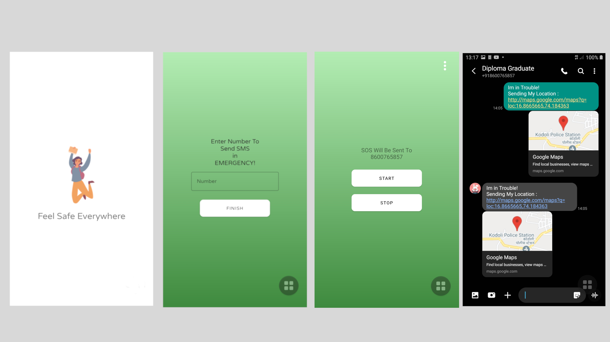

# Women Safety Application
## _Feel Safe Everywhere_

Women Safety App is user friendly application built in Android Studio,
it is simple to implement,easy to understand.

## Features

- Easy to implement
- Easy to understand
- Shake detector
- Shake device to send SOS to registered mobile
- Sends Last Known Location to registered mobile

**Free Software, Hell Yeah!**

[//]: # (These are reference links used in the body of this note and get stripped out when the markdown processor does its job. There is no need to format nicely because it shouldn't be seen. Thanks SO - http://stackoverflow.com/questions/4823468/store-comments-in-markdown-syntax)

   
